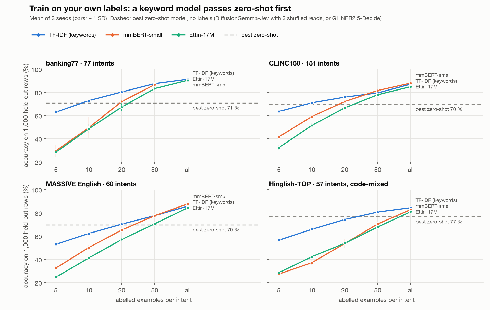

<h1 align="center">sieve</h1>

**Per-customer text classifiers: start zero-shot on day one, train on the customer's own labels, and switch each
question to the trained model only when it wins on held-out rows.**

Python 3.12. Runs on a laptop CPU or Apple GPU. Customer data stays in a local, gitignored folder. No account, no
telemetry.

[](LICENSE)
[](#install)
[](#verify-it-yourself)
[](#commands)



## Install

| Platform | Command |
|---|---|
| macOS / Linux, [uv](https://docs.astral.sh/uv/) | `git clone https://github.com/NakliTechie/sieve && cd sieve && uv venv .venv --python 3.12 && VIRTUAL_ENV=.venv uv pip install "gliner2[train]" scikit-learn` |

Build a stand-in customer from public data, release it, and ask it something:

```bash
python3 pipeline/samples.py build shop       # prints the import command; run it
.venv/bin/python pipeline/djp.py release shop --arms gliner,tiny,mmbert
.venv/bin/python pipeline/serve.py &         # port 8090
curl -s localhost:8090/c/shop/v1/systemone -d '{"state": "where is my parcel? it was due monday"}'
```

Each answer names the model that produced it. The first release downloads GLiNER2.5-Decide, Ettin-17M and
mmBERT-small from Hugging Face. No sign-in is needed.

## Why

You route messages or tag them by hand. A zero-shot model answers from day one, but on your own categories it tops
out around 65–75 %, and an LLM-style one changes its answer when you reorder the options. A model trained on your
labels does better, once you have enough of them. The hard part is knowing when that point has come, per question.

sieve runs every candidate on rows you labelled and it never trained on:
- zero-shot: [DiffusionGemma-Jev](https://github.com/taeold/djev-run) (with option-order averaging) and
  [GLiNER2.5-Decide](https://huggingface.co/fastino/GLiNER2.5-Decide);
- trained: [Ettin-17M](https://huggingface.co/jhu-clsp/ettin-encoder-17m) and
  [mmBERT-small](https://huggingface.co/jhu-clsp/mmBERT-small).

A trained model replaces the zero-shot one for a question only if it beats it on your held-out rows, on both
accuracy and log-loss. The winner is served exactly as it was scored.

**Use something else if** you already have thousands of labels and one fixed task: a plain fine-tune in
[transformers](https://huggingface.co/docs/transformers/tasks/sequence_classification) or
[SetFit](https://github.com/huggingface/setfit) is simpler. If you have no labels and never will,
[GLiNER2](https://github.com/fastino-ai/GLiNER2) or [TypeLLM](https://github.com/TypeLLM/TypeLLM) alone is enough.

## What the experiments found

Eight public, human-labelled datasets (English, Hindi, Hinglish), 1,000 fixed test rows each, 3 seeds. Details and
every table are in [results/](results/).
- **Intent routing:** a model trained on your labels passes the best zero-shot model at 20–50 labels per intent,
  and wins by 8–20 points with full data. Below 50 labels per intent, a TF-IDF keyword model beats fine-tuned
  mmBERT on all 6 intent datasets. It trains in seconds on a CPU.
- **Judgement calls** (toxicity, sentiment): zero-shot holds on far longer. On real Hinglish sentiment it wins at every
  label count.
- **No labels yet:** training on zero-shot answers alone never beat the zero-shot model (9 of 9 datasets). A person
  checking the half it is least sure of was enough to beat it on 6 of 9.
- **Option order:** reversing the options flipped 24 % of DiffusionGemma-Jev's answers. Averaging 3 shuffled reads
  halved that, and added 17–26 points on 60–151-option sets.
- **Languages:** one mmBERT trained on English and Hindi beat separate per-language models. Code-mixing (Hinglish)
  cost every model 4–6 points.

## Adding labels

```bash
.venv/bin/python pipeline/djp.py label shop new-rows.jsonl   # {"state": "...", "answers": {"category": "refund"}}
```

This appends the rows, retrains, re-runs the gate, and moves the live release only on a pass. Running it again with
the same file changes nothing. `rollback` returns to the previous passing release.

## Commands

```bash
python3 pipeline/djp.py status [--json]                     # every customer: live release, accuracy vs bar, model per question
python3 pipeline/djp.py init | import | check <c> …          # onboard a customer's CSV/JSONL
.venv/bin/python pipeline/djp.py eval | release <c> [--arms djev,gliner,tiny,mmbert]   # score every candidate | gate and release
.venv/bin/python pipeline/djp.py label <c> <file>           # append labels -> retrain -> gate -> release
python3 pipeline/djp.py rollback <c> [version]              # CURRENT -> an earlier passing release
.venv/bin/python pipeline/serve.py                          # POST /c/<c>/v1/systemone, GET /c/<c>
.venv/bin/python pipeline/bench.py fetch all                # the 8 public benchmark sets
.venv/bin/python pipeline/curve.py run <set> [--arms …] [--seed N]   # stock vs trained at every label count
.venv/bin/python pipeline/distill.py review <set> --teacher …        # zero-shot labels + least-confident review
.venv/bin/python pipeline/charts.py                         # the charts in marketing/
```

Agents: every command is declared in [tools.json](tools.json) with its input schema, cost and
`delegable: agent | person-only`; adding labels is person-only. [SPEC.md §0](SPEC.md) is the agent contract. The
DiffusionGemma-Jev arm needs a `/v1/systemone` server at `DJEV_URL`; `--arms gliner,tiny,mmbert` keeps everything
local.

## Verify it yourself

```bash
python3 -m unittest discover tests        # gate, idempotent labels, crash mid-release, refusal, rollback, manifest parity
.venv/bin/python pipeline/compare.py      # rebuilds each release's predictions; asserts they equal the gated numbers
```

The gate refuses a release when no question beats the bar, and the live release stays (exit 7). A release killed
midway leaves the previous one live. Training runs one model at a time per machine, under a GPU memory cap.

## License

MIT. · [SPEC.md](SPEC.md) · [results/](results/) · [TRAINING.md](TRAINING.md) (trained-weights design) ·
[tools.json](tools.json)
